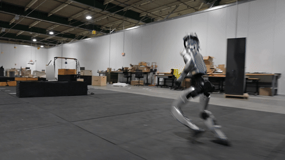

# [RSS 2026] Perceptive Humanoid Parkour: Chaining Dynamic Human Skills via Motion Matching

Zhen Wu\*, Xiaoyu Huang\*, Lujie Yang\*, Yuanhang Zhang, Xi Chen,
Pieter Abbeel†, Rocky Duan†, Angjoo Kanazawa†, Carmelo Sferrazza†, Guanya Shi†, C. Karen Liu†

[Project page](https://php-parkour.github.io/) ·
[arXiv](https://arxiv.org/abs/2602.15827) ·
[Video](https://youtu.be/IjeBnbm9sto)

<p align="center">
  
</p>

## Overview

PHP (Perceptive Humanoid Parkour) enables humanoid robots to autonomously
perform long-horizon, vision-based parkour across challenging obstacle courses.
The framework has three steps:

1. **Motion matching.** Compose retargeted atomic human skills into long-horizon
   trajectories offline using motion matching.
2. **Teacher training.** Train RL experts to track the trajectories with privileged
   state and terrain observations.
3. **Student training.** Distill the experts into a depth-based, multi-skill policy
   using DAgger + RL.

## Get started

For sim2sim with an existing ONNX pair, use the PHP launchers and pinned
[Holosoma setup](wbt_training/DEPLOY.md#get-holosoma-and-install-the-runtimes).

For motion matching and training, clone PHP with its pinned Holosoma submodule:

```bash
git clone --recurse-submodules https://github.com/amazon-far/php_parkour.git
cd php_parkour
```

PHP uses Holosoma's
[`jinkunc/php-release-port`](https://github.com/amazon-far/holosoma/tree/jinkunc/php-release-port)
branch. The exact tested revision is pinned by the `thirdparty/holosoma`
submodule and checked out by the recursive clone.

Choose a guide below for environment setup and commands. For training, use the
[prepared example datasets](wbt_training/README.md#example-motionterrain-datasets) or generate your own
with motion matching. If you already have an exported ONNX pair, go directly to sim2sim.

| Guide | Workflow | Requirements |
|---|---|---|
| [Motion matching](motion_matching/README.md) | Generate and inspect motion/terrain datasets; upload them for training or add new skills | Conda; no IsaacSim |
| [Training and evaluation](wbt_training/README.md) | Train teachers, distill a student, evaluate checkpoints, and export ONNX | Linux/NVIDIA with IsaacSim |
| [Sim2sim](wbt_training/DEPLOY.md) | Run the exported depth policy in MuJoCo | Holosoma's MuJoCo and inference environments |

## Example results

To try the example student policy in MuJoCo, download the validated ONNX pair
once it is available in [release-assets.json](release-assets.json). Run from
the PHP checkout root:

```bash
python scripts/download_assets.py student
```

The release contains sanitized `depth_backbone.onnx` and `student.onnx` files,
without raw `.pt` or teacher checkpoints. Files default to
`~/.cache/php-parkour/student`; pass `--destination DIR` to choose another
directory. If the student is marked `pending`, the downloader reports that it
is not yet available rather than substituting an intermediate model.

Follow the [sim2sim guide](wbt_training/DEPLOY.md) to run the policy. You can
also use the [automatically exported ONNX pair](wbt_training/README.md#export-to-onnx)
from your own student training run.

## Citation

```bibtex
@article{wu2026perceptive,
  title={Perceptive humanoid parkour: Chaining dynamic human skills via motion matching},
  author={Wu, Zhen and Huang, Xiaoyu and Yang, Lujie and Zhang, Yuanhang and Chen, Xi and Abbeel, Pieter and Duan, Rocky and Kanazawa, Angjoo and Sferrazza, Carmelo and Shi, Guanya and others},
  journal={arXiv preprint arXiv:2602.15827},
  year={2026}
}
```

Related: [OmniRetarget](https://omniretarget.github.io/).
